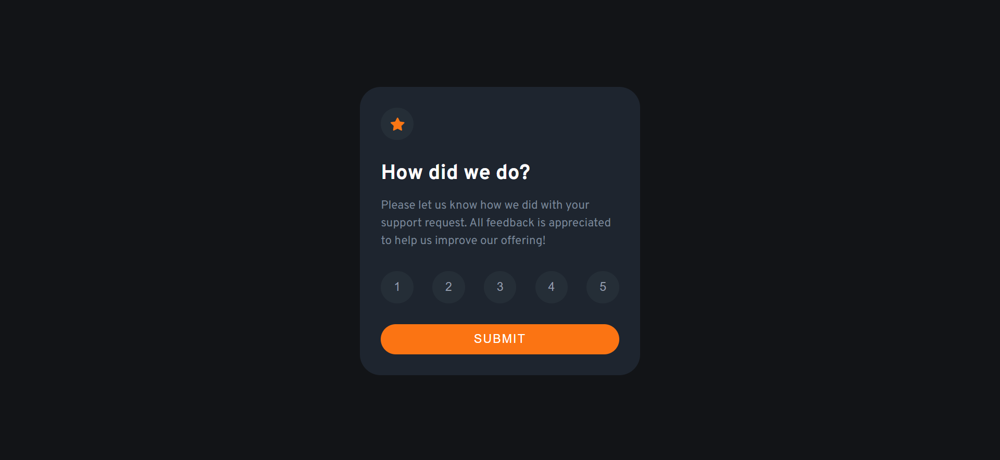
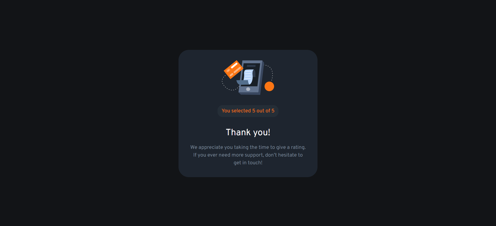
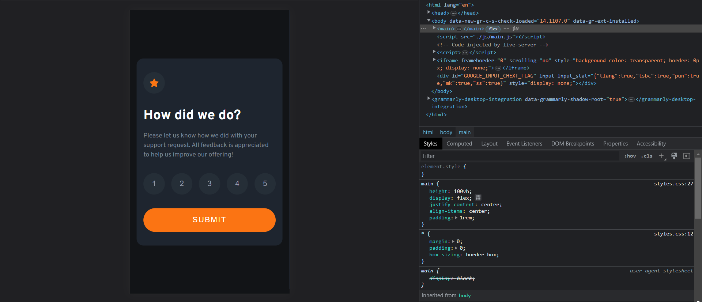

  <h1>Frontend Mentor - Interactive rating component solution</h1>
  <a href="https://interactive-rating-component-287.vercel.app/" target="_blank"><strong>➥ Live Demo</strong></a>

 

This is a solution to the [Interactive rating component challenge on Frontend Mentor](https://www.frontendmentor.io/challenges/interactive-rating-component-koxpeBUmI). Frontend Mentor challenges help you improve your coding skills by building realistic projects. 

## Table of contents

- [Overview](#overview)
  - [The challenge](#the-challenge)
  - [Screenshot](#screenshot)
  - [Links](#links)
- [My process](#my-process)
  - [Built with](#built-with)
  - [What I learned](#what-i-learned)
- [Author](#author)
- [Let's Connect](#letsconnect)

## Overview

### The challenge

Users should be able to:

- View the optimal layout for the app depending on their device's screen size
- See hover states for all interactive elements on the page
- Select and submit a number rating
- See the "Thank you" card state after submitting a rating

### Screenshot

### Links

- Solution URL: [Click Here](https://github.com/sudhanshu287/interactive-rating-component-fm)
- Live Site URL: [Live Demo](https://interactive-rating-component-287.vercel.app/)

## My process

### Built with

- Semantic HTML5 markup
- CSS custom properties
- Flexbox
- Mobile-first workflow

## Author

- Website - [Sudhanshu Patel](https://sudhanshupatel.vercel.app)
- Frontend Mentor - [@Sudhanshu287](https://www.frontendmentor.io/profile/sudhanshu287)
- Linkedin - [@Sudhanshu287](https://www.linkedin.com/in/sudhanshu287)

## **Let's Connect 👋**

  &nbsp;&nbsp;&nbsp;

  &nbsp;&nbsp;&nbsp;

   &nbsp;&nbsp;&nbsp;

  

